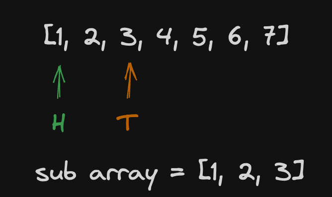

# Sliding Window

Sliding window is a technique often used in questions that involves getting sub array out of given array.

## How it works

The sliding window typically consists of two indices that are at the beginning point of the sub array and the end. We'll call these pointers as `head` and `tail`.

As the name suggests, manipulation of the sliding window is achieved by incrementing/decrementing `head` and/or `tail` as if the sub array is shifting left/right or expanding/shrinking. In the figure below, `head` is at `index 0` and tail is at `index 2`. Hence the sub array consists of elements of the original array starting from `index 0` and ends at `index 2`.

## Variations

### Fixed size
It requires to shift the window left and right, but the length of the sub array shouldn't be changed. Means that when wither `head` or `tail` moves, so does another to keep the distance between them.

#### Typical problem: https://leetcode.com/problems/maximum-number-of-vowels-in-a-substring-of-given-length

### Variable (dynamic) size
In contrast of fixes size, Variable size sliding window dynamically changes its length of it. So unlike the approach above, moving `head` or `tail` doesn't necessarily make another move either. 

#### Typical problem: https://leetcode.com/problems/best-time-to-buy-and-sell-stock/